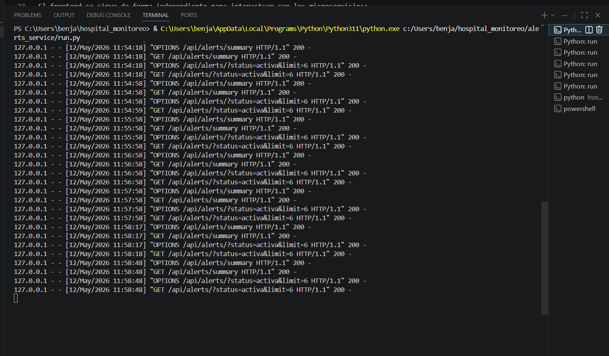
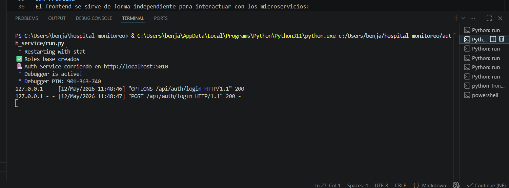
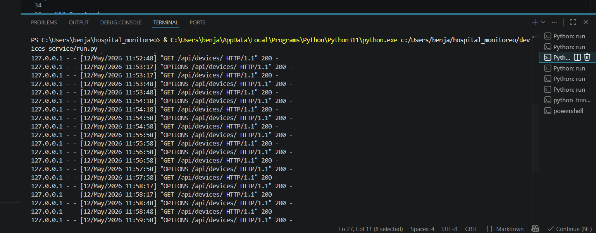
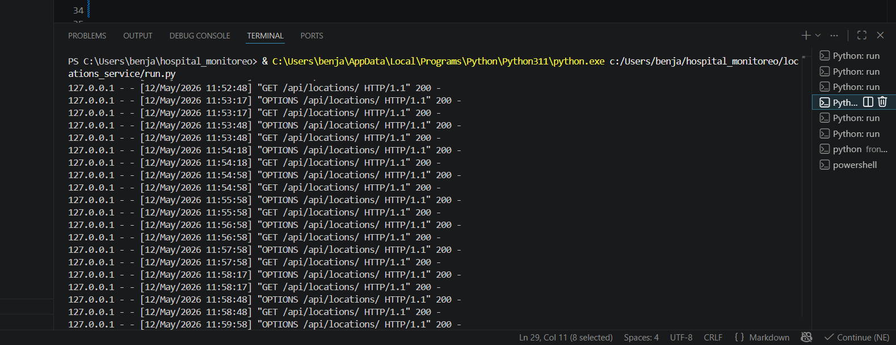
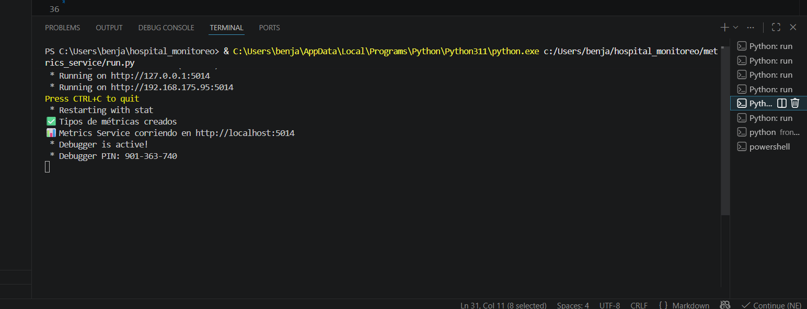
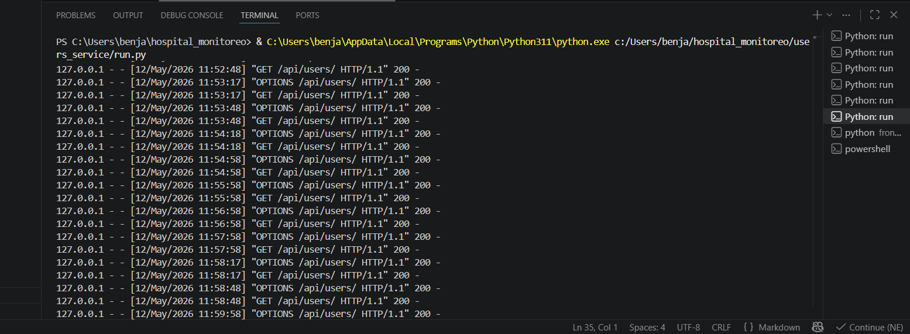
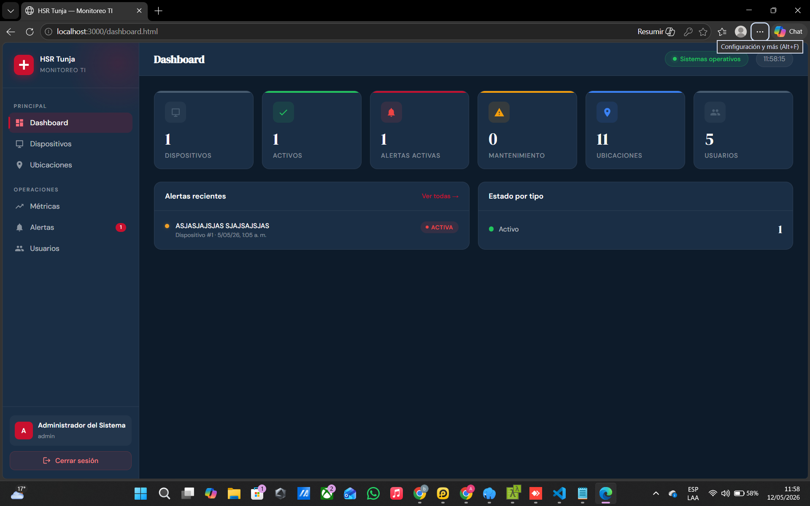

# Proyecto de Monitoreo - Tunja

Este repositorio contiene el código fuente para el sistema de monitoreo basado en microservicios.

## Integrantes
* Sara Sofía Lizarazo Barrera
* Laura Daniela Vargas Acero
* Anderson Benjamín Girón Villegas
* Mendoza Vega Carlos Yair

## Arquitectura de Microservicios
El sistema está compuesto por los siguientes servicios:
* **Auth Service:** Gestión de autenticación.
* **Users Service:** Administración de usuarios y roles.
* **Devices Service:** Monitoreo de dispositivos.
* **Alerts Service:** Sistema de notificaciones y alertas.
* **Locations Service:** Gestión geográfica de puntos de monitoreo.
* **Metrics Service:** Procesamiento de datos y métricas.

## Vista Previa del Uso
### Backend y Microservicios
Aquí se observa la ejecución del servicio de usuarios y la creación de tablas en la base de datos:
1.

2.

3.

4.

5.

6.

### Frontend
El frontend se sirve de forma independiente para interactuar con los microservicios:

## Cómo ejecutar el proyecto
1. Clonar el repositorio.
2. Configurar los entornos virtuales para cada microservicio.
3. Ejecutar `python run.py` dentro de cada carpeta de servicio.
4. Para el frontend, usar un servidor local (ej. `python -m http.server 3000`).